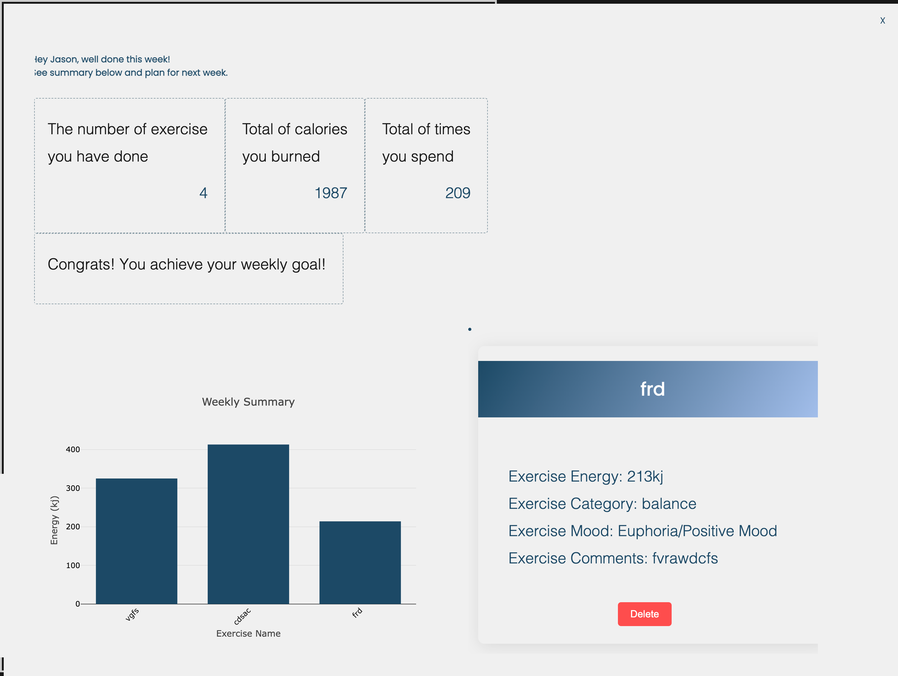

# README of xihe7988's DECO2017 Final Projects

## general layout:

  * __Feedback__:
  1. The previous layout results in a waste of space, as pages that are not expanded are always displayed.
  2. There is too much information presented to users at once.
  3. The gradient color makes the page appear messy.

  * __Improvements__:
  1. The new layout divides the page into three sections, displaying each content on an expanded page that occupies the full screen.
  2. Following the Law of Prägnanz, simple structures are used, avoiding complex shapes (Soegaard, 2023). The first page serves as a cover for users to navigate and only contains the most important choices.
  3. The colors have been changed to solid colors to achieve a clear and easily recognizable appearance. Additionally, each page has a different color, creating contrast to enhance learnability.

## section 1(profile section):

  * __Feedback__:
  1. The linear gradient color creates an issue. The goal box is not clear enough, leading to low readability for users.

  * __Improvements__:
  1. The background has been changed to a solid blue color, creating stronger contrast between the text and background.

  ## section 2(summary section):

  * __Feedback__:
  1. During accessibility testing of this page, it was found to have low contrast between the background and text. The result is only 3.94, however the ideal result is above 7.
  
  2. There are many text boxes, which appear messy.
  3. The white background may cause eye strain.
  4. When data is spread across multiple pages, users may need to navigate through various links or menus to find the information they are looking for. This can be time-consuming and may lead to frustration if the navigation is not intuitive or well-designed.
  5. The delete button is too small to click.

  * __Improvements__:
  1. The text color has been changed to a darker grey to improve accessibility for all users.
  2. All text boxes have been replaced with a summary data table, which is clearer and more intuitive. According to Miller's Law, the number of objects affects memory difficulty (Yablonski). Therefore, the number of objects has been reduced to enhance memorability.
  3. To improve user experience, the white background has been changed to a light grey color.
  4. All data has been moved to the 'Summary Section' instead of being on another page. Having all the necessary information on a single page provides a more seamless and streamlined user experience.
  5. The delete button has been redesigned as a prominent button instead of a small icon to make it more obvious and increase user learnability.

## section 3(form section):

  * __Feedback__:
  1. The high contrast of text and bg color may lead eye strain.
  2. User may have multiple mood.
  3. Entering the time can be complex due to the large number of input fields.

  * __Improvements__:
  1. The color has been redesigned to include a transitional middle color, reducing the high contrast.
  2. To increase user freedom, the task mood selection has been changed from a dropdown menu to checkboxes, allowing users to select one or more options.
  3. The time input type has been changed from text to a time picker, enabling users to choose the date and time more efficiently.

## Referencde:
1. Yablonski, J. (n.d.). Law of common region. Laws of UX. Retrieved 2023, from https://lawsofux.com/law-of-common-region/
2. Soegaard, M. (2023, April 28). The laws of figure/ground, PRÄGNANZ, closure, and common fate - gestalt principles (part 3). The Interaction Design Foundation. Retrieved April 28, 2023, from https://www.interaction-design.org/literature/article/the-laws-of-figure-ground-praegnanz-closure-and- common-fate-gestalt-principles-3
3. World Leaders in Research-Based User Experience. (n.d.). Fitts's law and its applications in UX. Nielsen Norman Group. Retrieved 2023, from https://www.nngroup.com/articles/fitts-law/
4. Yablonski, J. (n.d.). Jakob's law. Laws of UX. Retrieved 2023, from https://lawsofux.com/jakobs- law/
5. Yablonski, J. (n.d.). Miller's law. Laws of UX. Retrieved 2023, from https://lawsofux.com/millers- law/
6. Yablonski, J. (n.d.). Law of similarity. Laws of UX. Retrieved 2023, from https://lawsofux.com/law- of-similarity/
7. Chinchilla, M. A. (2016, March 8). Photo by Mateo Avila Chinchilla on unsplash. Beautiful Free Images & Pictures. Retrieved  2023, from https://unsplash.com/photos/x_8oJhYU31k
