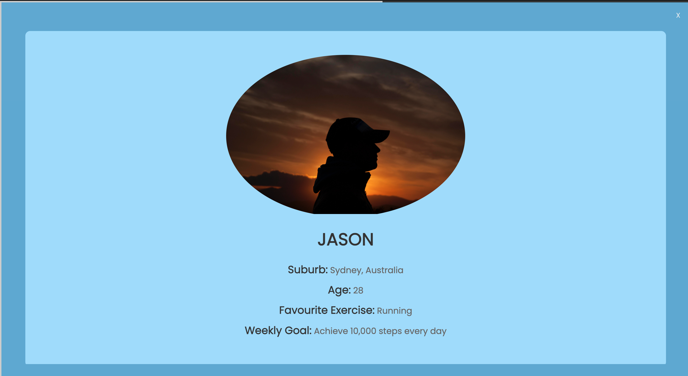

# README of xihe7988's DECO2017 Final Projects

## general layout:

  * __Feedback__:
  1. The previous layout results in a waste of space, as pages that are not expanded are always displayed.
  2. Too much information to users at the first time. 
  3. The gradient color makes page messy.

  * __Improvements__:
  1. The new layout is deviding page in to three section. Display each content on expanded page which is full screen.
  2. According to Law of Prägnanz, use simple structures and avoid complex shapes (Soegaard, 2023).The first page also can be cover for users to navigate which only contain the priority choice.
  3. The colors are changed to be solid colors to display a clear and easy to recognise appearance. Also, different page has different color which make a contrast to increase learnability.

## section 1(profile section):

  * __Feedback__:
  1. Linear gradient color issue. The box of goal is not clear enough which lead low readbility for users.

  * __Improvements__:
  1. The background has been change into solid blue. To make stronger contrast of text and background.

  ## section 2(summary section):

  * __Feedback__:
  1. As I test the accessibility of this page, result shows it has low contrast between background and text.
  
  2. A lot of text box which look messy.
  3. White background may lead eye strain.
  4. When data is spread across multiple pages, users may need to navigate through various links or menus to find the information they are looking for. This can be time-consuming and may lead to frustration if the navigation is not intuitive or well-designed.
  5. The button of delete is too small to click

  * __Improvements__:
  1. I have changed text color into a darker grey to create better accessibility for all users.
  2. I have replaced all of text box by a summary data table which is more clear and more intuitive. According to Miller's Law, the number of objects will leads memory difficulty (Yablonski). So, I have decreased the number of objects to increase memorability.
  3. To improve user experience, the white backgroud has been changed into the light grey.
  4. I have moved all data on the 'summary section' instead of on another page. Because having all the necessary information on a single page can provide a more seamless and streamlined user experience. 
5. 
